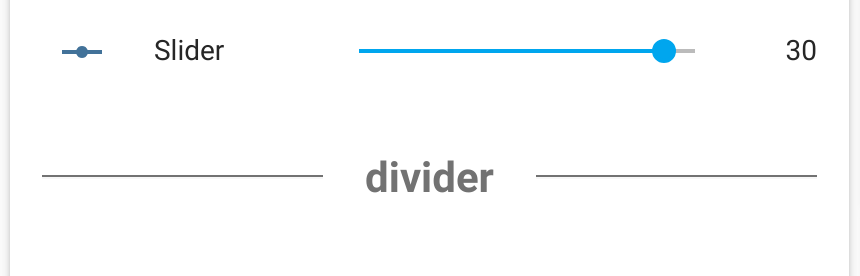
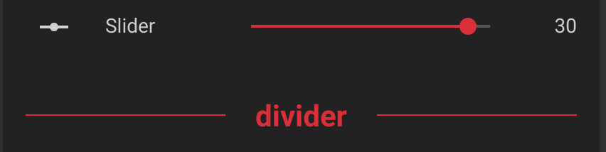

# :deciduous_tree: Text Divider Row

This card is for [Lovelace](https://www.home-assistant.io/lovelace) on [Home Assistant](https://www.home-assistant.io/) to display a text divider in an entities card

## Installation

Use [HACS](https://hacs.xyz) or follow this [guide](https://github.com/thomasloven/hass-config/wiki/Lovelace-Plugins)

```yaml
resources:
  url: /local/text-divider-row.js
  type: module
```




## Options

| Name | Type   | Requirement  | Description                |
| ---- | ------ | ------------ | -------------------------- |
| type | string | **Required** | `custom:text-divider-row`  |
| text | string | **Required** | Text to display in divider |
| margin | string or number | Optional | Custom margin CSS |
| align | string | Optional | Specifies the text alignment. Must be: 'left', 'center' or 'right' |

## Theme Variables

The following variables are available and can be set in your theme to change the appearance of the lock.
Can be specified by color name, hexadecimal, rgb, rgba, hsl, hsla, basically anything supported by CSS.

| name                     | Default                | Description   |
| ------------------------ | ---------------------- | ------------- |
| `text-divider-color`     | `secondary-text-color` | Divider color |
| `text-divider-font-size` | `14px`                 | Font size     |
| `text-divider-line-size` | `1px`                  | Line size     |

## [Troubleshooting](https://github.com/thomasloven/hass-config/wiki/Lovelace-Plugins)
